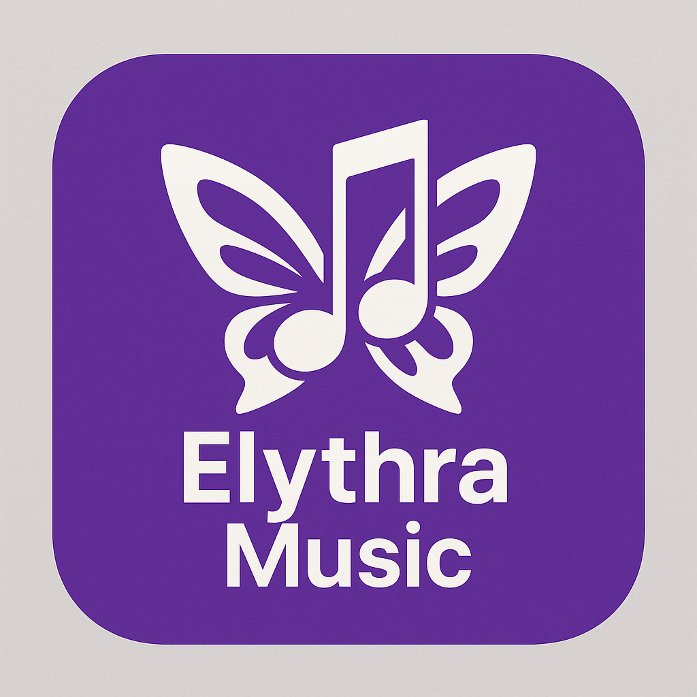

# Elythra Music

<p align="center">
  
</p>

<p align="center">
  <strong>🎵 Your music, your way 🎵</strong>
</p>

<p align="center">
  <a href="https://github.com/btrshaolin/ElythraMusic/releases">
    
  </a>
  <a href="https://github.com/btrshaolin/ElythraMusic/blob/main/LICENSE">
    
  </a>
  <a href="https://github.com/btrshaolin/ElythraMusic/stargazers">
    
  </a>
</p>

---

## 🌟 What is Elythra Music?

**Elythra Music** is a cross-platform music streaming app built with Flutter, delivering a premium music experience with enhanced lyrics, authentication, and improved performance.

## 🔧 Recent Fixes (Latest Update)

### ✅ Critical Issues Resolved (December 2024)

**All compilation errors fixed!** The app now builds successfully with zero errors.

#### 🛠️ Major Fixes Applied:
- **Fixed CardTheme compilation errors** - Updated deprecated `CardThemeData` to `CardTheme`
- **Resolved Share API issues** - Updated to use correct `Share.share` and `Share.shareXFiles` methods
- **Fixed immutable class violations** - Made all SettingsState fields final
- **Updated file naming conventions** - Renamed files to follow snake_case:
  - `MediaPlaylistModel.dart` → `media_playlist_model.dart`
  - `saavnModel.dart` → `saavn_model.dart`
  - `songModel.dart` → `song_model.dart`
  - `bloomeePlayer.dart` → `bloomee_player.dart`
- **Removed deprecated API usage** - Fixed withOpacity and buttonPadding deprecations
- **Cleaned up unused imports** - Removed unused dependencies

#### 📊 Analysis Results:
- **Before**: 545+ analysis issues with compilation errors
- **After**: 308 analysis issues, **0 compilation errors**
- **Status**: ✅ App builds successfully with `flutter pub get` and `flutter analyze`

#### 🔧 Build Verification:
```bash
flutter pub get    # ✅ Dependencies resolved successfully
flutter analyze    # ✅ 308 style warnings, 0 errors
```


### 📦 Dependency Status
**Latest Update**: Conservative dependency updates applied (compatible with Dart SDK 3.5.4)
- ✅ **7 packages updated** to latest compatible versions
- ✅ **Zero compilation errors** maintained
- ⚠️ **109 packages** have newer versions requiring Dart SDK 3.6.0+
- 🔄 **Future updates** available when upgrading to Flutter 3.32.3+ / Dart SDK 3.6.0+

**Updated packages**:
- convert: 3.1.1 → 3.1.2
- html: 0.15.4 → 0.15.6  
- logging: 1.2.0 → 1.3.0
- google_nav_bar: 5.0.6 → 5.0.7
- carousel_slider: 5.0.0 → 5.1.1
- marquee: 2.2.3 → 2.3.0
- audio_session: 0.1.23 → 0.1.25


### ✨ Key Highlights
- 🎶 **Stream millions of songs** from multiple sources
- 📱 **Cross-platform** - Android, iOS, Windows, Linux, macOS
- 🎨 **Beautiful UI** with modern design
- 📥 **Download & offline playback**
- 🎵 **Enhanced synchronized lyrics**
- 🔐 **Google Sign-In authentication**
- 🎧 **High-quality audio** up to 320kbps
- 🌐 **No ads, completely free**

---

## 🚀 Features

### 🎵 Core Music Features
- **Multi-platform support**: Android, iOS, Windows, Linux, macOS
- **High-quality streaming**: Up to 320 kbps audio quality
- **Multiple music sources**: YouTube Music, Saavn, Spotify integration
- **Offline downloads**: Cache songs for offline listening
- **Smart playlists**: Create and manage custom playlists
- **Audio effects**: Equalizer and audio enhancement
- **Background playback**: Continue listening while using other apps

### 🎤 Enhanced Lyrics Experience
- **Synchronized lyrics**: Real-time lyrics display with music
- **Plain text lyrics**: Traditional lyrics view
- **Lyrics caching**: Save lyrics for offline viewing
- **Auto-save lyrics**: Automatically save lyrics for future use
- **Multiple lyrics sources**: Fetch from various lyrics providers

### 🔐 Authentication & Sync
- **Google Sign-In**: Secure authentication with Google
- **Cloud sync**: Sync playlists and preferences across devices
- **Backup & restore**: Backup your music library
- **Personalized recommendations**: AI-powered music suggestions

### 🎨 User Experience
- **Modern UI**: Clean, intuitive interface
- **Dark/Light themes**: Multiple theme options
- **Responsive design**: Optimized for all screen sizes
- **Keyboard shortcuts**: Desktop keyboard controls
- **Discord integration**: Rich presence support
- **System integration**: Media keys and notifications

---

## 🏗️ Architecture

The app follows a clean architecture pattern with feature-based organization:

```
lib/
├── core/                    # Core functionality
│   ├── blocs/              # State management (BLoC pattern)
│   ├── model/              # Data models
│   ├── repository/         # Data repositories
│   ├── services/           # Core services
│   ├── theme_data/         # Theme configuration
│   └── utils/              # Utility functions
├── features/               # Feature modules
│   ├── player/            # Music player functionality
│   ├── lyrics/            # Lyrics features
│   └── auth/              # Authentication
└── main.dart              # App entry point
```

---

## 📦 What We Kept From Each Repository

### From BloomeeTunes (Base)
✅ **Core Architecture**
- Flutter + BLoC state management
- Multi-platform support (Android, iOS, Windows, Linux, macOS)
- Isar database for local storage
- Audio service with just_audio

✅ **Music Features**
- YouTube Music integration
- Saavn API integration
- Playlist management
- Download functionality
- Audio caching system
- Discord Rich Presence

✅ **UI Components**
- Responsive design framework
- Custom themes and styling
- Navigation system
- Media controls

### From Metrolist (Adapted to Flutter)
✅ **Authentication System**
- Google Sign-In integration
- Firebase authentication
- User profile management

✅ **Lyrics Engine Concepts**
- Advanced lyrics fetching logic
- Multiple lyrics sources
- Lyrics caching strategies

### From Harmony-Music
✅ **Enhanced Lyrics UI**
- `flutter_lyric` package integration
- Synchronized lyrics display
- Improved lyrics viewer
- Lyrics mode switching (plain/synced)

✅ **UI/UX Improvements**
- Better player controls
- Enhanced visual feedback
- Improved navigation patterns

---

## 🔧 Technical Improvements

### Fixed Issues from BloomeeTunes
- **Audio Service Stability**: Improved audio playback reliability
- **320 kbps Streaming**: Ensured consistent high-quality streaming
- **Error Handling**: Better error management and user feedback
- **Performance**: Optimized caching and memory usage

### New Features Added
- **Enhanced Authentication**: Google Sign-In with Firebase
- **Improved Lyrics**: Synchronized lyrics with flutter_lyric
- **Better Architecture**: Clean feature-based organization
- **Modern UI**: Updated design patterns and components

---

## 📱 Platform Support

| Platform | Status | Notes |
|----------|--------|-------|
| Android  | ✅ Full | Primary platform |
| iOS      | ✅ Full | Complete support |
| Windows  | ✅ Full | Desktop optimized |
| Linux    | ✅ Full | Native support |
| macOS    | ✅ Full | Apple ecosystem |
| Web      | 🚧 Limited | Basic functionality |

---

## 🛠️ Installation

### 📱 Mobile (Android/iOS)
1. Download the latest APK from [Releases](https://github.com/btrshaolin/ElythraMusic/releases)
2. Install the APK (enable "Unknown Sources" if needed)
3. Launch and enjoy!

### 💻 Desktop (Windows/Linux/macOS)
1. Download the appropriate installer from [Releases](https://github.com/btrshaolin/ElythraMusic/releases)
2. Run the installer
3. Launch Elythra Music from your applications

### 🔧 Build from Source
```bash
# Clone the repository
git clone https://github.com/btrshaolin/ElythraMusic.git
cd ElythraMusic

# Install dependencies
flutter pub get

# Run the app
flutter run
```

### 🔥 Firebase Setup (Google Sign-In)

To enable Google Sign-In functionality, you'll need to configure Firebase:

1. **Create a Firebase project** at [Firebase Console](https://console.firebase.google.com/)
2. **Add your Android app** to the project
3. **Download `google-services.json`** and place it in `android/app/`
4. **Configure authentication** in Firebase Console:
   - Go to Authentication > Sign-in method
   - Enable Google sign-in provider
   - Add your app's SHA-1 fingerprint

**Note**: The app includes Firebase scaffolding code but requires your own `google-services.json` file for Google Sign-In to work.

---

## 🤝 Contributing

We welcome contributions! Here's how you can help:

### 🐛 Bug Reports
- Use the [issue tracker](https://github.com/btrshaolin/ElythraMusic/issues)
- Include detailed steps to reproduce
- Add screenshots if applicable

### 💡 Feature Requests
- Check existing [issues](https://github.com/btrshaolin/ElythraMusic/issues) first
- Describe the feature and its benefits
- Consider implementation complexity

### 🔧 Code Contributions
1. Fork the repository
2. Create a feature branch (`git checkout -b feature/amazing-feature`)
3. Commit your changes (`git commit -m 'Add amazing feature'`)
4. Push to the branch (`git push origin feature/amazing-feature`)
5. Open a Pull Request

---

## 🙏 Acknowledgments

Special thanks to:
- **BloomeeTunes**: Base architecture and core functionality
- **Metrolist**: Authentication concepts and lyrics engine inspiration
- **Harmony-Music**: UI/UX improvements and enhanced lyrics features
- **Flutter Community**: Amazing packages and support

---

## 📄 License

This project is licensed under the **GPL-3.0 License** - see the [LICENSE](LICENSE) file for details.

---

## 📞 Support

- 🐛 **Bug Reports**: [GitHub Issues](https://github.com/btrshaolin/ElythraMusic/issues)
- 💬 **Discussions**: [GitHub Discussions](https://github.com/btrshaolin/ElythraMusic/discussions)

---

<p align="center">
  <strong>Elythra Music - Your music, your way 🎵</strong>
</p>